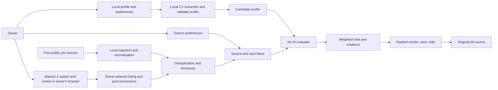

# Architecture direction

**Status:** PLAN-001 M1/M2 and M3a/M3b plus owner-waiver decisions are pushed to `main`; PLAN-002 M1/M2 and accessibility/privacy fixes are pushed. PLAN-003 M1 manual X lead flow is pushed. PLAN-004 M1 CV-first automated workflow is pushed to `main` at `ea2b73ab53580acee1558b56c2832d50cd4b4e8f`. PLAN-005 M1 local-origin form fix is pushed to `main` at `b3b1bc56843866d0cffd8dc834fd93430956b217`. PLAN-006 M1, M2, and validated M3 source/crawler work are pushed; JustRemote's public-page crawl remains explicitly partial. PLAN-007 M1 search-history work is in progress. TypeSafe account facts and device encryption remain unverified under owner waiver; personal relevance calibration remains open.
**Updated:** 2026-10-06

## Owner-set cost ceiling

This is a single-user local app, not a hosted service. In the current runtime, the owner allocates at most **$5 per rolling 30 days to TypeSafe Jev and $0 to every other component or source**. The app reserves against a $4 rolling 30-day request limit, leaving $1 as a planned buffer. This guard covers only requests Clue makes; it cannot cap other uses of the same key or establish account-wide charges. On 2026-09-30 the owner waived TypeSafe account/terms/refill verification; those facts remain unknown and were not inspected. Keep the CV, profile, search settings, listing index, and results on the user's device; after a one-time opt-in, TypeSafe receives selected profile and listing fields automatically after searches when other scoring gates pass. PLAN-019 adds a separately gated OpenAI lane for per-listing research and file generation; no live provider request or personal-data pilot has been performed.

## System boundary

The local app searches and ranks jobs for its owner. It keeps a candidate profile, search preferences, a local listing index, and fit results on the owner's device. Employers and job boards remain the authorities for whether a position is active and how to apply. TypeSafe Jev is the external evaluator for job matching; the PLAN-019 GPT-6 Luna integration is limited to application research and content generation and cannot alter Jev's match decisions.

The diagram describes the connector-fed local workflow. X leads use a separate manual handoff: the user opens X, reviews an employer listing, and adds it locally. The implementation remains subject to offline validation and source-specific review.

## Component responsibilities

| Component | Responsibility | Boundary |
|---|---|---|
| Local profile and preferences | Save the owner's CV/profile, edits, search preferences, and delete controls on device | No login, account service, or multi-user access. Keep direct identifiers out of Jev payloads. |
| CV extraction | Read PDF and DOCX documents locally, derive profile fields and likely roles, save them, and start a search | Keep the resulting profile editable. Be conservative when inferring roles or language; do not treat an omission as proof of missing capability. |
| Source registry and connectors | Fetch listings through $0 APIs, public feeds, public ATS boards, or ordinary public employer career pages | Each connector records access/terms notes, geography, refresh rules, attribution, local cache/retention, limits, and data expiry. No blanket employer-by-employer opt-in; do not bypass login or access controls. X is manual-only and is never scheduled or fetched. |
| Manual X lead handoff | Build a role/location search link and accept an owner-reviewed X post permalink, employer/ATS URL, and job details | The app makes no X API/site request and never fetches, expands, previews, or automatically opens submitted URLs. Display the destination host and preserve the post URL separately from the job URL. |
| Listing normalization | Map different source fields to a common job record | Preserve original values and provenance; do not invent salary, remote, authorization, or posted-date data. |
| Quality and deduplication | Detect duplicates, expired/closed signals, invalid source URLs, and stale records | Preserve source IDs and canonical application pages so results can be traced. |
| Search filters | Apply exact user-controlled conditions and retrieve likely candidates | Missing values are `unknown`; only exclude unknowns when the user requested that behavior. |
| Jev adapter | Send bounded, minimal state and versioned questions to TypeSafe; retain typed result and uncertainty locally | Protect the API key in local configuration. Treat candidate-derived profile fields as personal data even after direct identifiers are removed. |
| Rank and evidence | Combine criterion results using user weights and attach CV/job evidence | Do not let the model decide permissions, apply, contact, or select a person for an employer. |
| Results UI | Show source, freshness, fit evidence, confidence, and user actions | User opens the original listing; the platform does not submit applications. |

## Data flow and controls

1. Store the original CV locally on the owner's device. Extract a structured, editable profile and start a search from the upload action. The user can correct it later without re-uploading.
2. Keep direct contact details out of the fit request. For matching, send only relevant candidate qualifications/preferences and the normalized job description needed for evaluation.
3. A work history can identify a person even without name or contact details. The app discloses the exact fields sent and requires a one-time opt-in; when enabled, Jev runs automatically after a search if the key, language, and app-side budget gates pass. The owner waived provider-side terms and retention verification for this personal local scope; those details remain unverified.
4. Keep source provenance and freshness in the local listing index. Preserve the employer's posted date separately from first-seen and last-checked dates.
5. For X, keep discovery in the owner's browser. Add only a user-reviewed lead to the local index; label it manually added and do not present the entry time as a live availability check. Do not send X post text to Jev.
6. Make the local delete control cover profile, original CV, extracted data, preferences, saved/hidden jobs, fit results, search history, and owner-added sources. Preserve built-in source definitions, but clear personal role-feed cache hashes and refresh timestamps. Manual backup/restore and local deletion are tested; the owner waived device-encryption confirmation. Deletion cannot affect data already processed by TypeSafe.
7. Keep an audit trail for the scoring version and input snapshot without retaining more personal data than evaluation and support need.

## Search and scoring pipeline

1. Select connectors based on the user's country, query, enabled source rights, and zero-recurring-cost requirement.
2. Fetch from the local listing index and due $0 feeds/APIs, then run bounded due company-board and public-page crawls; do not launch an unbounded crawl for each individual search.
3. Normalize, filter obvious stale/closed records, deduplicate, and keep a direct source URL.
   For a manual X lead, the owner supplies the direct listing URL and the separate X post URL. Clue validates their shape, displays the job-link hostname, and does not make any request to either URL.
4. Apply hard user filters in deterministic code. Keep workplace type, where the person can work from, and work authorization separate. Preserve exact location-eligibility evidence; for the first Milan/Italy search, a generic “remote” label does not confirm the job can be done from Italy.
5. Automatically send up to five filtered listings per Jev request when enabled, with four versioned categorical `Choice` questions per listing: role alignment, skills evidence, experience/scope, and optional preferences. Each question can return `unknown`; missing evidence is not treated as a mismatch. Treat profile and listing fields as untrusted evidence, never as instructions. Jev scoring is currently limited to profile text marked English and listings confidently identified as English. Without opt-in, a key, supported language, or available budget, keep listings visible and explain why they are unscored.
6. Convert the returned 0–4 choice probabilities to a 0–1 fit signal and combine dimensions with the user's weights in code, renormalizing over dimensions with evidence. This is not a calibrated hiring probability.
7. Build reasons from matched profile facts and exact listing text; label absent evidence as unknown. Sort and display the best results and include the sources searched.

## Company-site ingestion and crawler guardrails

Clue's target search path is: profile-matched company directory → employer's official careers link → its linked ATS/public board → current vacancy details → Italy eligibility filter → Jev ranking. Company ecosystem lists seed the directory but do not provide job data. Use documented public ATS endpoints/feeds when available; otherwise discover job pages through the official career page, its sitemap, RSS/Atom, `JobPosting` JSON-LD, and scoped HTML links. Do not guess ATS tokens, traverse unrelated site sections, or scrape general search-result pages.

PLAN-006 M3 adds a six-hour batch over tracked companies. Scrapling follows each employer's career path, can resolve supported ATS boards linked from that site, streams parsed jobs into local deduplication, and reads robots.txt for sitemap discovery while ignoring `Disallow` for page filtering. The expanded local profile allows 25 HTML pages, 10 child sitemaps, 50 sitemap job pages, and 20 dynamic pages per company batch. Company and sitemap spiders use eight global requests, at most two per domain, and a one-second base delay. Explicit access denials, rate limits, and challenges pause a host without retry. Transient source errors use a five-minute retry window instead of consuming the normal refresh interval. The first synthetic live batch checked 20 companies across the five catalog groups; three linked ATS boards resolved, eight listings parsed, and three redirected sources were marked unavailable. This sample does not establish coverage for all 80+ companies.

The company directory and official board resolver automatically qualify public, no-auth board paths for this local personal app; the owner does not complete a per-employer approval checklist. Keep source status visible, and stop only the affected connector when it returns a denial, challenge, rate limit, or explicit block. Continue checking other companies. Clue ignores robots.txt `Disallow` for page retrieval and may use the file only to discover sitemap URLs. Use an identifying crawler User-Agent, at most two concurrent requests per domain, a one-second base delay, conditional requests where available, and `Retry-After`. Never bypass a block.

The default freshness target is a source check within 24 hours for a “recently checked” label. Source terms or rate limits may require slower refresh. In that case, show the actual last-check age or mark the listing stale/unknown; do not claim it is currently open. Keep publisher `datePosted`, publisher `validThrough`, ingestion time, and last verification as separate fields. A source check records response bytes/status, raw and parsed counts, parser failures, 404 signals, and duplicate merges in the local search history; each job-source link retains its observed/last-seen time and current source state. A 404 marks a check partial and leaves cached jobs stale; a publisher expiration or the source's retention rule controls removal.

Scrapling is the selected crawler for company discovery and public employer/ATS pages. Use its async Spider for batches, sitemap discovery, expanded job/career links, streamed items, and structured JSON-LD extraction before HTML fallback. Render detected public JavaScript career shells within the batch cap. The local profile is `robots_txt_obey = False`, `concurrent_requests = 8`, `concurrent_requests_per_domain = 2`, `download_delay = 1.0`, and `max_blocked_retries = 0`. The identified User-Agent, HTTPS/public-host confinement, response-size caps, bounded page budgets, and source-specific API/feed terms remain. Explicit 401/403/429 or anti-bot challenges pause the affected host with no retry. Do not use stealth fetchers, proxy rotation, impersonation, or CAPTCHA automation. Owner-added supported public sources activate after public-host validation and remain user-pausable. See the [source discovery review](../research/source-discovery-and-crawl-review.md), [profile-aware board-discovery research](../research/profile-aware-company-board-discovery.md), and [ADR 0009](../decisions/0009-broader-local-public-crawling.md).

Scrapling automatically retries blocked requests unless configured otherwise. Set `max_blocked_retries = 0`: a `401`, `403`, `429`, challenge, or explicit block stops that source without retry. The current private-app registry has thirteen built-in entries: ten active feed/API/crawler connectors, one manual X route, and two manual-only job-board links. Owner-added supported public sources are enabled for the next search and can be paused from Sources. Frequently updated public feeds refresh hourly; daily publisher feeds remain daily. Public company pages and JustRemote refresh every six hours. Non-blocking fetch/parser errors retry after five minutes rather than consuming the normal interval. Per-source attribution, retention, and publisher request ceilings remain recorded in the [source review](../research/source-discovery-and-crawl-review.md). RemoteJobs.org remains limited to one page per role query per day, at most four role queries, with visible credit. Himalayas uses a role/country-filtered public search of up to 25 pages per daily refresh. JustRemote's local crawl budget is 200 pages; prior live HTML inspection returned two details from 18 requests, so coverage after the wider budget remains unverified. Wellfound and Dynamite Jobs remain manual because their published terms exclude automated public-board scraping. The 20-company live sample resolved three ATS boards and indexed eight public postings; broader catalog coverage remains unverified.

## Chosen local implementation stack

The first increment uses FastAPI/Uvicorn on `127.0.0.1`, Jinja templates, semantic HTML, project-owned CSS and small vanilla JavaScript, and SQLite through Python's standard library. PDF and DOCX text extraction stays on-device with `pypdf` and `python-docx`. The local database and original CV live in ignored `.data/`; project configuration loads the TypeSafe key from the ignored `.env`. The request boundary accepts `127.0.0.1`, `localhost`, and `::1` as local aliases only when the form origin uses the same scheme and effective port. It honors browser `Sec-Fetch-Site: same-origin`, rejects `cross-site`, and falls back from opaque Origins to Referer when Fetch Metadata is unavailable. It rejects external origins. This keeps ingestion, storage, and fit evaluation in one local Python runtime without a separate frontend build, hosted database, or third-party UI service. See [ADR 0005](../decisions/0005-local-python-application.md).

Use TypeSafe's official Python SDK for `/v1/systemone`, with Jev pinned to `jev-1.13.0`. Configure `RetryPolicy(max_retries=0)`. Before each request, reserve an 80,000-token allowance at the current documented input price, then settle successful responses to returned `usage.input_tokens`; ambiguous failures retain the reservation. The app enforces a $4.00 inference cap over a rolling 30-day period, leaving $1.00 of the owner's $5 ceiling as a buffer. See [ADR 0006](../decisions/0006-jev-scoring-and-budget-guard.md).

Per [ADR 0017](../decisions/0017-ai-engineering-prefilter.md), `job_focus` screens normalized board/company jobs before indexing, active cached candidates before snapshotting, and historical scoring retries before Jev. It uses title and actual implementation evidence, omits company marketing when a role section exists, and reports reason counts separately from deduplication. Missing salary or seniority does not exclude a relevant candidate. Jev retains nuanced fit, pay, level and location decisions in five-listing batches. Existing cached records, scores and broad historical snapshots are retained. Search queries use AI-focused title alternatives; Himalayas searches them separately within its existing total 25-page cap. Company discovery does not use past SQL/BI experience to prioritize generic analytics. This supersedes ADR 0010's all-listings rule.

The local implementation includes profile/CV management, source management, feed/ATS/Scrapling adapters, SQLite persistence, deterministic search, Jev scoring, results, saved/hidden views, and local deletion. PLAN-006 M2 adds a local profile-ranked directory of 80+ employers with persistent tracking; M3 connects due tracked boards to the search worker. The source register also includes the requested remote-job boards; Wellfound and Dynamite Jobs are manual-only. The PLAN-001 M2 comparison with Prima Lever EU is historical. PLAN-002 M2 and PLAN-001 M3a used synthetic Jev inputs only; no real CV or live job listing was sent to Jev. M3a's five-item benchmark scored `nDCG@5 = 1.0` for Jev and the keyword baseline on assistant-authored labels, so it confirms the evaluation path but not personal relevance or Jev's advantage. M3b tested local backup/restore and deletion with synthetic data; see the [backup and deletion guide](../operations/local-data-backup-and-deletion.md). The app now requires one-time disclosure/opt-in and automatically checks eligible results after searches. Connector coverage and personal relevance calibration remain open. PLAN-004 records the CV-first workflow.

## Provider and deployment choices still open

- JustRemote's lazy-load placeholders reveal only two posting-detail links through its ordinary public-page path; its coverage remains partial under the no-undocumented-endpoints decision.
- Personio's documented XML route requires an `X-Company-ID` header. Use the public HTML/sitemap path unless an official career page exposes the identifier.
- Live listing recall and location eligibility across the remaining company catalog; the 20-company smoke is a bounded sample only.
- Additional languages and calibrated Jev rubrics; the first implementation only attempts English profile/listing pairs and still needs evaluation.
- Local usability target: WCAG 2.2 AA, a 24-hour freshness label, and 30-second p95 search response against an already indexed dataset.
- Personal relevance calibration; the synthetic benchmark ties the keyword baseline and is not evidence of Jev superiority. The app reserve does not verify or cap account-wide charges.
- Spoken screen-reader review; browser accessibility-tree and keyboard checks are recorded in PLAN-002, while no speech-reader playback control was available.

## Operational constraints

- Do not run Jev over every indexed job on every search. Use metadata filtering and deduplication first.
- Do not claim live availability solely from `datePosted`. Use source status signals, expiration, and a recent check; display when last checked.
- Never fall back invisibly to a different AI model when Jev is unavailable. A search can still show listings with a “fit not evaluated” state.
- Version the question rubric and model ID; sample and review ranking changes before rollout.
- Add a source connector only after checking its public personal-use path, terms, supported geography, attribution, local retention, and $0 recurring cost at expected use.

## Jev-coordinated application preparation

**PLAN-019 core local flow implemented; OpenAI calls remain disabled until owner configuration.** The Python/FastAPI/Jinja/SQLite app has a local evidence register, immutable opportunity snapshots, a per-listing preparation queue, versioned packets, bounded public contact research, provenance, interview practice, and owner-reported outcome records. The OpenAI key remains empty in `.env.example`. Before any API call, the owner must configure the key, consent, monthly and per-opportunity limits, and the current rate card. Live API and Gmail behavior remain unverified.

### Jev and GPT responsibilities

The normal search flow may discover and deduplicate listings, apply deterministic hard gates, run Jev, and update rankings/history. It does not call the Researcher or writing/practice stages. Each eligible listing waits in `not_requested` until the owner clicks **Prepare application** on that listing. That action binds one run to its opportunity and current revisions; no bulk or scheduled action may start preparation.

Run the existing deterministic hard gates and Jev assessment first. Jev remains the sole candidate/job matching validator and continues to own its current fit, filter, qualification, and seniority outputs. Clue passes the saved Jev result to the OpenAI agent as read-only, versioned input. Jev conflicts block generation; review or unassessed states wait for owner resolution. GPT-6 Luna (`gpt-6-luna`, `reasoning.effort=max`) uses the OpenAI Responses API. A separate Researcher stage directs bounded research through Clue's existing Scrapling-backed crawler and returns sourced, timestamped findings; the later writing/practice stages cannot browse. Those stages use reviewed technical evidence, owner-confirmed descriptive-profile writing preferences, and permitted CV references to prepare tailored CVs, cover letters, application answers, outreach drafts, and interview practice. The owner may keep several existing CVs as local content/layout references, set a default or let the agent recommend a permitted base per role, and choose whether it may improve structure; originals remain unchanged. GPT cannot calculate or modify Jev decisions. The local harness owns state, stage order, tool permissions, budget enforcement, content/source validation, and deterministic document rendering; the owner reviews the complete packet at one final checkpoint.

### GPT-6 Luna stages

The same configured model is invoked through distinct role prompts and typed outputs under Clue orchestration; the stages do not have separate credentials or independent control. The Researcher receives public job/company/team search context and no CV or private profile claims. Diagnoser checks locally extracted resume text and visible structure for concrete parsing/readability risks, without claiming to reproduce an unknown ATS or explain ghosting. Recruiter maps required/preferred criteria to reviewed claim IDs and CV sections; any coverage percentage measures document evidence coverage, not job fit. Jev's saved fit and qualification result remains visible and read-only. Rewriter proposes Google XYZ-style bullet revisions only where claim evidence supports each fact or metric; it can retain qualitative outcomes and never creates numbers. Hiring Manager is an optional practice module that asks challenging role-specific questions and gives a transparent assessment of the owner's answers; its feedback is not a fit score or hiring prediction.

### Harness, budget, and action boundary

Function calls are tool proposals executed only by a local allowlist. The Researcher alone can request bounded public crawls through Scrapling; subsequent stages may read only the approved opportunity, claim/Jev context, and cited research packet, then return typed draft proposals or ask the owner to resolve a fact. The local harness starts a run only from the explicit per-listing owner trigger, reserves budget after the trigger, and prevents duplicate clicks from launching duplicate runs. No stage has arbitrary filesystem, shell, logged-in browser, Gmail, message-send, connection-request, employer-form, or submission access. Web content is untrusted data, and generated text is checked against reviewed claim IDs and source references before rendering.

Keep OpenAI usage in a separate reservation/settlement ledger with monthly and per-opportunity caps. Jev's $4 rolling 30-day app reserve toward the $5 owner ceiling remains unchanged. The owner has not selected OpenAI cap amounts, so API calls remain disabled until both caps, separate personal-data consent, a non-empty key, and a current rate card are configured. Treat published rates and tool charges as volatile and recheck them immediately before enabling calls. Keep personal claims, contact research, consent, usage records, and generated packets local and deletable; do not commit their values to Git.

The final review screen shows contact evidence and the exact recipient/subject/body. After the owner approves it, a separate Clue Gmail adapter can create an unsent draft; the owner edits or sends that draft in Gmail. Clue cannot send messages, and all application forms and submissions remain manual. The Gmail API's `gmail.compose` scope required to create drafts also permits sending, so isolate the credential in an adapter that exposes only draft creation; do not expose a Gmail function to GPT. The Codex GitHub/Gmail connectors are separate from Clue's API integration; Clue needs its own Gmail authorization. If the owner does not accept that scope, keep the email in Clue for copy/paste. The optional background worker, automated follow-up reminders, external tracker sync, and cohort analytics are deferred. See [PLAN-019](../plans/PLAN-019-application-preparation-framework.md) and accepted [ADR 0023](../decisions/0023-application-preparation-and-action-boundaries.md).
