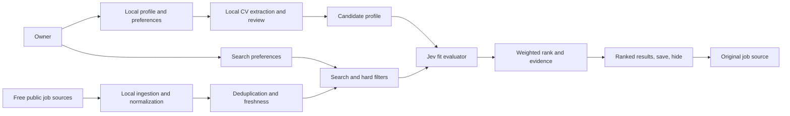

# Architecture direction

**Status:** WORKING — proposed boundaries, no technology stack selected  
**Updated:** 2026-09-30

## Owner-set cost ceiling

This is a single-user local app, not a hosted service. Spend is capped at **$5/month for TypeSafe Jev and $0/month for every other component or source**. TypeSafe currently lists $42 per billion input tokens and says output is free, but the launch is early access and actual credit conversion, taxes, and Order terms must be confirmed. Disable automatic paid-credit refills and enforce a $5 all-in application-side usage cap. Keep the CV, profile, search settings, listing index, and results on the user's device; TypeSafe is the only planned external processing service.

## System boundary

The local app searches and ranks jobs for its owner. It keeps a candidate profile, search preferences, a local listing index, and fit results on the owner's device. Employers and job boards remain the authorities for whether a position is active and how to apply. TypeSafe Jev is the only planned external evaluator for bounded fit questions.

The diagram is a proposal, not an implementation record. An owner decision and feasibility evidence may change these boundaries.

## Component responsibilities

| Component | Responsibility | Boundary |
|---|---|---|
| Local profile and preferences | Save the owner's CV/profile, edits, search preferences, and delete controls on device | No login, account service, or multi-user access. Keep direct identifiers out of Jev payloads. |
| CV extraction | Read PDF and DOCX documents and produce a structured profile the user can review | The user reviews extraction before use. Do not treat a parser's omission as proof of missing capability. |
| Source registry and connectors | Fetch listings through $0 APIs, public feeds, public ATS boards, or ordinary public employer career pages | Each source records access/terms notes, geography, refresh rules, attribution, local cache/retention, limits, and data expiry. No blanket employer-by-employer opt-in; do not bypass login or access controls. |
| Listing normalization | Map different source fields to a common job record | Preserve original values and provenance; do not invent salary, remote, authorization, or posted-date data. |
| Quality and deduplication | Detect duplicates, expired/closed signals, invalid source URLs, and stale records | Preserve source IDs and canonical application pages so results can be traced. |
| Search filters | Apply exact user-controlled conditions and retrieve likely candidates | Missing values are `unknown`; only exclude unknowns when the user requested that behavior. |
| Jev adapter | Send bounded, minimal state and versioned questions to TypeSafe; retain typed result and uncertainty locally | Protect the API key in local configuration. Treat candidate-derived profile fields as personal data even after direct identifiers are removed. |
| Rank and evidence | Combine criterion results using user weights and attach CV/job evidence | Do not let the model decide permissions, apply, contact, or select a person for an employer. |
| Results UI | Show source, freshness, fit evidence, confidence, and user actions | User opens the original listing; the platform does not submit applications. |

## Data flow and controls

1. Store the original CV locally on the owner's device. Extract a structured profile, ask the user to correct it, and let them control whether it is retained for saved searches.
2. Keep direct contact details out of the fit request. For matching, send only relevant candidate qualifications/preferences and the normalized job description needed for evaluation.
3. A work history can identify a person even without name or contact details. The product must disclose TypeSafe as a processor, explain the data fields and U.S. processing, use the applicable DPA/transfer terms, and establish lawful notice and retention before live use.
4. Keep source provenance and freshness in the local listing index. Preserve the employer's posted date separately from first-seen and last-checked dates.
5. Make the local delete control cover profile, original CV, extracted data, preferences, saved jobs, fit results, and scheduled searches. Define local backup and TypeSafe deletion behavior before real-CV use.
6. Keep an audit trail for the scoring version and input snapshot without retaining more personal data than evaluation and support need.

## Search and scoring pipeline

1. Select connectors based on the user's country, query, enabled source rights, and zero-recurring-cost requirement.
2. Fetch from the local listing index and $0 feeds/APIs; do not launch an unbounded crawl for each individual search.
3. Normalize, filter obvious stale/closed records, deduplicate, and keep a direct source URL.
4. Apply hard user filters in deterministic code. Keep workplace type, where the person can work from, and work authorization separate. Preserve exact location-eligibility evidence; for the first Milan/Italy search, a generic “remote” label does not confirm the job can be done from Italy.
5. Send a small candidate set to Jev with one versioned request and a compact set of job-related questions. A proposed rubric can cover role alignment, required-skill evidence, experience/scope, and user-weighted preferences. Validate the number of questions and token size against TypeSafe limits and cost before finalizing.
6. Combine Jev scores with the user's weights in code. Do not map the result to 0–100 or interpret Jev confidence as a hiring probability until offline validation supports the labels.
7. Build reasons from matched profile facts and exact listing text; label absent evidence as unknown. Sort and display the best results and include the sources searched.

## Company-site ingestion and crawler guardrails

Use source-specific ingestion workers behind the source registry. Start with documented APIs/feeds. For company sites, seed from the employer's official careers link or an employer-provided URL, then stay within that career path and any linked public ATS board. Prefer job sitemaps, RSS/Atom, and `JobPosting` JSON-LD. Use HTML selectors as a bounded fallback. Do not brute-force employer or ATS identifiers, crawl unrelated site areas, scrape search-result pages, or begin crawling at user request time.

An ingestion worker can fetch only source-registry entries marked `Approved`: $0 at expected use, a public path suited to personal use, and known attribution/refresh/local-retention rules. Check `robots.txt` and source terms separately; RFC 9309 makes clear that robots rules are not access authorization. Use an honest crawler identity, no more than one request per domain concurrently, a conservative delay (2 seconds by default unless source terms or crawl directives require longer), conditional requests where available, and `Retry-After`. A 401/403/429, CAPTCHA/bot challenge, or explicit block pauses that connector. Never try to get around the block.

The default freshness target is a source check within 24 hours for a “recently checked” label. Source terms or rate limits may require slower refresh. In that case, show the actual last-check age or mark the listing stale/unknown; do not claim it is currently open. Keep publisher `datePosted`, publisher `validThrough`, ingestion time, and last verification as separate fields.

Scrapling is the selected crawler for registered public HTML job and career pages, including employer and ATS pages. Use its `Spider` with `robots_txt_obey = True`, `concurrent_requests = 4`, `concurrent_requests_per_domain = 1`, and a base `download_delay = 2.0`; Scrapling applies stricter `Crawl-delay` and `Request-rate` directives by increasing the delay. Set an identifying project User-Agent through ordinary request headers, use static HTTP fetching first, and use browser rendering only when necessary and allowed by the source's published rules. Do not use stealth fetchers, proxy rotation, impersonation, anti-bot bypass, or CAPTCHA automation. Keep the crawler behind the connector boundary so it can be replaced if local validation finds a concrete problem. See the [source discovery review](../research/source-discovery-and-crawl-review.md) and [ADR 0003](../decisions/0003-bounded-public-company-crawling.md).

## Provider and deployment choices still open

- Specific approved sources by selected geography, API keys/approvals, and actual permitted use; track them in the source registry.
- Source-specific Scrapling parsers and request schedules after a bounded local crawl validation.
- Local UI/runtime choice, local database and file storage, and a safe place to keep the Jev API key.
- Local database/file format, CV parser, search implementation, and UI runtime.
- Local deletion and backup behavior; TypeSafe telemetry, retention, deletion, and international transfer terms.
- Jev model/version, personal API access terms, request limits, availability behavior, and an outage state.
- Language support and Jev rubrics; the local UI starts in English and only scores language pairs validated in evaluation.
- Local usability target: WCAG 2.2 AA, a 24-hour freshness label, and 30-second p95 search response against an already indexed dataset.
- Per-search Jev usage that remains under the $5/month all-in cap.

## Operational constraints

- Do not run Jev over every indexed job on every search. Use metadata filtering and deduplication first.
- Do not claim live availability solely from `datePosted`. Use source status signals, expiration, and a recent check; display when last checked.
- Never fall back invisibly to a different AI model when Jev is unavailable. A search can still show listings with a “fit not evaluated” state.
- Version the question rubric and model ID; sample and review ranking changes before rollout.
- Add a source connector only after checking its public personal-use path, terms, supported geography, attribution, local retention, and $0 recurring cost at expected use.
